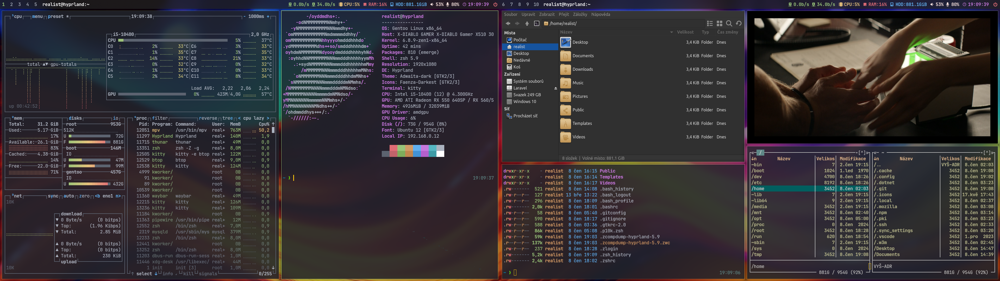
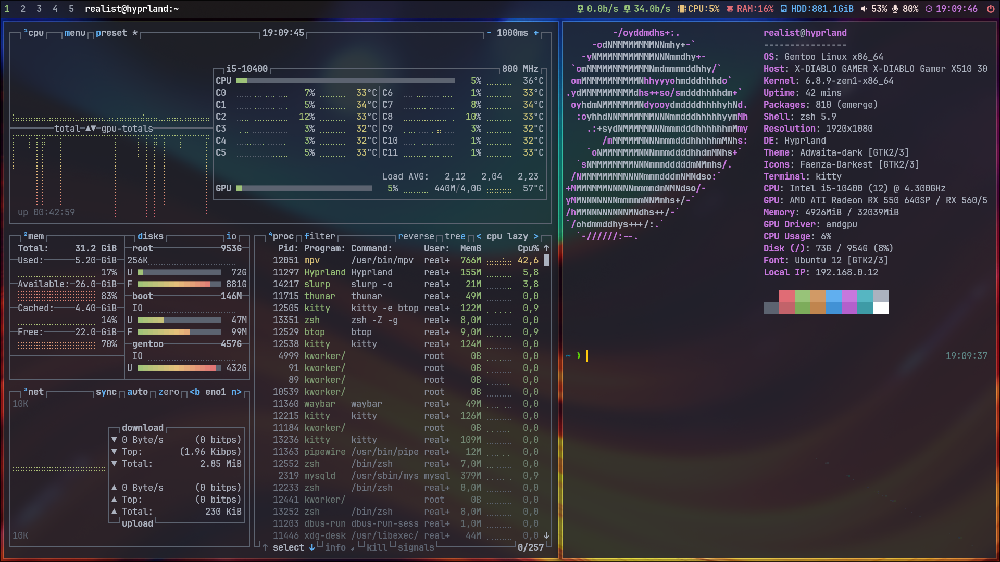

# Realist's Hyprland Minimal Desktop [ RHMD ] on Gentoo Linux ( no Xwayland version )

## About this project

RHMD is project contained complete Gentoo linux  installation commands and config files for create minimized own Gentoo desktop with Hyprland. This desktop is intended for web developers, but it can also be used by a regular user.

## Final desktop - Dual monitors screenshot



## Final desktop - One monitor screenshot



## Grub Screen


## Create install environment

### Partitions
```
parted -s /dev/sdb mklabel gpt && parted -a optimal /dev/sdb
```

#### Parted commands

```
unit mib
mkpart primary fat32 1 150
name 1 UEFI
set 1 bios_grub on
mkpart primary 150 -1
name 2 ROOT
quit
```
```
mkfs.fat -n UEFI -F32 /dev/sdb1 && mkfs.f2fs -l ROOT -O extra_attr,inode_checksum,sb_checksum -f /dev/sdb2
```
```
mkdir -p /mnt/gentoo && mount -t f2fs /dev/sdb2 /mnt/gentoo
```
```
mkdir -p /mnt/gentoo/boot && mount /dev/sdb1 /mnt/gentoo/boot
```

### Stage3 and config portage

```
cd /mnt/gentoo
```
```
wget https://distfiles.gentoo.org/releases/amd64/autobuilds/20240623T164908Z/stage3-amd64-openrc-20240623T164908Z.tar.xz
```
```
tar xpf stage3-amd64-openrc-20240623T164908Z.tar.xz --xattrs-include='*.*' --numeric-owner
```
```
mkdir -p /mnt/gentoo/var/db/repos/gentoo && mkdir -p /mnt/gentoo/etc/portage/repos.conf
```
```
cp /mnt/gentoo/usr/share/portage/config/repos.conf /mnt/gentoo/etc/portage/repos.conf/
```
```
cp /etc/resolv.conf /mnt/gentoo/etc/
```

### Mounting important system FS

```
mount -t proc none /mnt/gentoo/proc && mount -t sysfs none /mnt/gentoo/sys
```
```
mount --rbind /sys /mnt/gentoo/sys && mount --make-rslave /mnt/gentoo/sys
```
```
mount --rbind /dev /mnt/gentoo/dev && mount --make-rslave /mnt/gentoo/dev
```
```
mount --rbind /run /mnt/gentoo/run && mount --make-rslave /mnt/gentoo/run
```
```
test -L /dev/shm && rm /dev/shm && mkdir /dev/shm
```
```
mount --types tmpfs --options nosuid,nodev,noexec shm /dev/shm && chmod 1777 /dev/shm
```

### Chroot to prepared system

```
chroot /mnt/gentoo /bin/bash && env-update && source /etc/profile
```

### Sync and config portage

```
emerge-webrsync
```
```
cd /etc/portage/
```
```
rm make.conf && rm -R package.use && rm -R package.accept_keywords && rm -R package.mask
```

### File - /etc/portage/make.conf

```
wget https://raw.githubusercontent.com/lotrando/gentoo-hyprland/main/make.conf
```

### File - /etc/portage/package.accept_keywords

```
wget https://raw.githubusercontent.com/lotrando/gentoo-hyprland/main/package.accept_keywords
```
### File - /etc/portage/package.use

```
wget https://raw.githubusercontent.com/lotrando/gentoo-hyprland/main/package.use
```

### Edit file - /etc/portage/package.license

```
wget https://raw.githubusercontent.com/lotrando/gentoo-hyprland/main/package.license
```

### Edit file - /etc/portage/package.mask

```
wget https://raw.githubusercontent.com/lotrando/gentoo-hyprland/main/package.mask
```
### Edit file - /etc/fstab

```
nano /etc/fstab
```
```
/dev/sdb1         /boot   vfat    noatime       0 2
/dev/sdb2         /       f2fs    defaults,rw   0 0
```

```
sed -i 's/localhost/hyprland/g' /etc/conf.d/hostname
```
```
sed -i 's/default8x16/ter-v16b/g' /etc/conf.d/consolefont
```
```
sed -i 's/us/cz/g' /etc/conf.d/keymaps
```
```
sed -i 's/127.0.0.1/#127.0.0.1/g' /etc/hosts
```
```
echo "127.0.0.1 hyprland.gentoo.dev hyprland localhost" >> /etc/hosts
```

### Edit file - /etc/locale.gen

```
nano /etc/locale.gen
```

```
cs_CZ.UTF-8 UTF-8
cs_CZ ISO-8859-2
```
```
echo "Europe/Prague" > /etc/timezone
```

### Create locale

```
locale-gen
```
```
eselect locale set 4
```
```
env-update && source /etc/profile
```

```
export PS1="(chroot) ${PS1}"
```

### Edit file - /etc/conf.d/net

## Static network (variable, default dhcp)

```
nano /etc/conf.d/net
```
```
config_enp0s3="192.168.0.30 netmask 255.255.255.0"
routes_enp0s3="default via 192.168.0.1"
```
```
cd /etc/init.d/
```
```
ln -s net.lo net.enp0s3
```

## Compiling phase

```
emerge -g python gcc llvm clang
```

### Create zen-kernel and install important system packages

```
emerge -g dhcpcd grub os-prober terminus-font sudo f2fs-tools dev-vcs/git usbutils eselect-repository genkernel linux-firmware zen-sources --noreplace nano && genkernel all
```

### Add repository overlay mv for OH-MY-ZSH

```
eselect repository enable mv && emaint sync -r mv && emerge --oneshot sys-apps/portage
```
```
emerge oh-my-zsh gentoo-zsh-completions zsh-completions
```

### Install oh-my-zsh plugins and p10k theme

```
git clone https://github.com/romkatv/powerlevel10k.git /usr/share/zsh/site-contrib/oh-my-zsh/custom/themes/powerlevel10k
```
```
git clone https://github.com/zsh-users/zsh-autosuggestions.git /usr/share/zsh/site-contrib/oh-my-zsh/custom/plugins/zsh-autosuggestions
```
```
git clone https://github.com/zsh-users/zsh-syntax-highlighting.git /usr/share/zsh/site-contrib/oh-my-zsh/custom/plugins/zsh-syntax-highlighting
```

## Desktop - HYPRLAND
```
eselect repository enable guru && emaint sync -r guru
```
```
emerge seatd hyprland hyprpaper hyprland-contrib xdg-desktop-portal-hyprland waybar grim slurp kitty pipewire eix gentoolkit ubuntu-font-family gvfs rofi-wayland qt5ct faenza-icon-theme adwaita-qt wlogout pulsemixer pavucontrol mpv audacious roboto imagemagick firefox eza neofetch btop rocm-smi thunar xarchiver thunar-media-tags-plugin thunar-archive-plugin media-video/ffmpegthumbnailer ristretto tumbler app-misc/mc
```

## Variable
```
emerge virtualbox && gpasswd -a realist vboxuser
```

### Create user (replace realist and toor with custom user and password)

```
useradd -m -G audio,video,usb,cdrom,portage,users,wheel,pipewire,input -s /bin/bash realist
```
```
echo "root:toor" | chpasswd -c SHA256
```
```
echo "realist:toor" | chpasswd -c SHA256
```

## Configurations

### Grubdev-python/pygobject
```
nano /etc/default/grub
```
```
GRUB_GFXMODE=1920x1080x32
GRUB_GFXPAYLOAD_LINUX=keep
GRUB_BACKGROUND="/boot/grub/grub.png"
GRUB_DISABLE_OS_PROBER=0
GRUB_DEFAULT=0
GRUB_TIMEOUT=5
```

### Sudo

```
sed -i 's/# %wheel ALL=(ALL:ALL) ALL/%wheel ALL=(ALL:ALL) ALL/g' /etc/sudoers
```

### USER - dotfiles setting

```
cd /home/realist
```
```
git clone https://github.com/lotrando/realist-hyprland-desktop-rice.git
```
```
chown -R realist:realist /home/realist/
```

### Change default shell to OH-MY-ZSH

```
chsh -s /bin/zsh root && chsh -s /bin/zsh realist
```

### Grub Install
```
grub-install --target=x86_64-efi --efi-directory=/boot --bootloader-id=HYPRLAND --recheck /dev/sda
```
```
cd /boot/grub && wget -q wget https://raw.githubusercontent.com/lotrando/realist-hyprland-desktop/main/grub.png
```
```
grub-mkconfig -o /boot/grub/grub.cfg
```

### Run daemons

```
rc-update add elogind boot && rc-update add consolefont default && rc-update add numlock default
```
```
rc-update add sshd default && rc-update add dbus default && rc-update add dhcpcd default
```

### Cleaning and reboot to Hyprland desktop

```
cd / && umount -R /mnt/gentoo && reboot
```

# Keybinding of Hyprland desktop (Complete)

| Keys                | Function                                                 |
| ------------------- | -------------------------------------------------------- |
| Win-Shift-Enter     | Rofi Drun                                                |
| Win-Shift-Backspace | Rofi Apps                                                |
| Win-Shift-p         | Rofi Powermenu                                           |
| Win-Shift-q         | Hyperland Quit                                           |
| Win-Shift-c         | Kill focused window                                      |
| Win-Enter           | Run Kitty                                                |
| Win-Alt-b           | Run Firefox                                              |
| Win-Alt-f           | Run Thunar                                               |
| Win-Alt-t           | Run Btop                                                 |
| Win-j               | Shrink vert window width                                 |
| Win-m               | Move focus to the master window                          |
| Win-Up              | Move focus to the next window                            |
| Win-Down            | Move focus to the prev window                            |
| Win-Right.          | Switch focus to next monitor                             |
| Win-Left,           | Switch focus to prev monitor                             |
| Win-t               | Toggle floating window back to tile                      |
| Win-Space           | Toggles noborder/full                                    |
| Win-s               | Grab all monitors screenshot                             |
| Win-Alt-s           | Chose monitor to grab screenshot                         |
| Win-Alt-a           | Chose area to grab screenshot                            |
